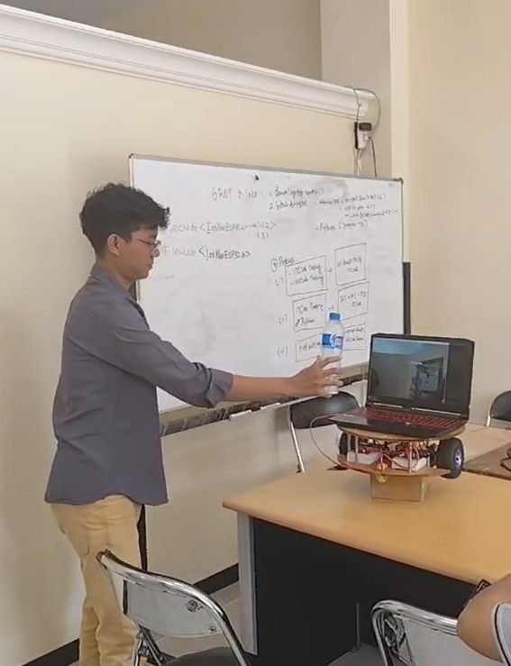

# 🤖 Robotika Learning Repository

Selamat datang di repositori ini! Repositori ini dibuat sebagai dokumentasi dan penyimpanan progres belajar penulis dalam bidang **robotika**, baik dalam bentuk source code, catatan eksperimen, maupun referensi dari berbagai laboratorium dan institusi.

# Kegiatan Perkuliahan

# Pertemuan Pertama
[Perkenalan Mata Kuliah Robotik]
Pada pertemuan pertama mata kuliah robotik, seperti kegiatan awal pertemuan seperti umumnya yakni berkenalan. Mulai dari berkenalan dengan dosen pengampu, yakni Pak Basuki, kemudian dilanjut dengan berkenalan atau meraba sedikit tentang robotik. Pada tahap ini, kami menerima penjelasan mengenai apa saja yang akan dilakukan pada mata kuliah robotik ini, seperti bagaimana skema pembelajarannya, pengerjaan UTS, hingga pengerjaan UAS.

# Pertemuan Kedua
[Instalasi Arduino IDE]
Pada pertemuan kedua mata kuliah robotik, kegiatan pembelajaran difokuskan pada pengenalan dan instalasi Arduino IDE sebagai platform utama dalam pemrograman mikrokontroler. Selain itu, kami juga mempelajari bagaimana cara melakukan instalasi beberapa library penting yang akan digunakan dalam pengerjaan project pada mata kuliah robotik, serta bagaimana konfigurasi beberapa setup yang diperlukan.

# Pertemuan Ketiga
[Praktik Arduino IDE dengan ITCLab]
Pada pertemuan keempat mata kuliah robotik, diisi dengan praktik langsung menggunakan ITCLab, Disini kami mencoba untuk melakukan running program yang telah disediakan untuk menghidupkan dan mematikan LED. Pertemuan ini berfokus pada pemahaman konsep dasar pin digital pada Arduino IDE serta proses upload program ke board melalui ITCLab.

# Pertemuan Keempat
[Praktik Arduino IDE Dengan IMCLab]
Pada pertemuan ketiga mata kuliah robotik, kami mencoba melakukan running program yang disediakan oleh Pak Basuki, yakni menghidupkan mesin pada ITCLab, yang di mana mesin tersebut nanti akan diaktifkan, ketika sudah aktif, mesin tersebut akan memutar "gerigi" yang telah dikonfigurasi dari cepat ke lambat. Jadi ketika awal dinyalakan, "gerigi" tersebut akan berputar secara cepat, kemudian semakin melambat, dan berhenti.

# Pertemuan Kelima
[Kontrol Motor Dengan IMCLab]
Pada pertemuan kelima mata kuliah robotik, pembelajaran lanjut menggunakan IMCLab. Disini, kami mencoba mengendalikan motor dengan konfigurasi perintah dari Arduino IDE. Praktik pada pertemuan ini bertujuan untuk mengenal bagaimana penggunaan pin PWM dan dasar-dasar kendali penggerak melalui mikrokontroler.

# Pertemuan Keenam
[Pengenalan IoT dan MQTT Panel]
Pada pertemuan keenam mata kuliah robotik, pembelajaran masuk ke konsep Internet of Things (IoT), disini kami diarahkan untuk menginstal aplikasi IoT MQTT Panel di handphone. Kemudian, kami belajar menghubungkan Arduino IDE ke MQTT dengan bantuan library PubSubClient, sehingga Arduino IDE dapat berkomunikasi melalui jaringan internet. Dalam konfigurasinya, diperlukan sebuah hotspot dari handphone, kemudian memasukkan value nama hotspot beserta passwordnya pada sebuah kode dalam Arduino IDE.

# Pertemuan Ketujuh
[Praktik Kontrol Robot BNU V2 Via IoT MQTT Panel]
Pada pertemuan ketujuh mata kuliah robotik, kami mencoba mengendalikan robot BNU V2 dengan menggunakan aplikasi IoT MQTT Panel. Disini, kami mengirimkan sebuah perintah melalui MQTT Panel yang diterjemahkan menjadi aksi pada robot secara real-time. Praktik ini bertujuan untuk memahami penerapan praktis tentang komunikasi IoT menggunakan protokol MQTT.

# Pengerjaan Final Project

# Pada Minggu 1 :
- Mencari dataset Waste Classification Data di kaggle [Lihat dataset](https://www.kaggle.com/datasets/techsash/waste-classification-data).
- Mulai membangun model CNN dari awal yakni dengan menggabungkan beberapa layer convolutional dengan beberapa layer yang lainnya.
- Melakukan training terhadap dataset training yang telah ditemukan.
- Melakukan evaluasi terhadap dataset testing yang telah ditemukan.
- Mendapatkan hasil yang kurang memuaskan karena dari hasil evaluasi hanya mendapatkan accuracy 0.5.

# Pada Minggu 2 :
- Mencoba meningkatkan nilai accuracy model agar menjadi lebih baik.
- Melakukan training model baru dengan dataset training.
- Melakukan testing model baru dengan dataset testing.
- Mendapatkan Hasil yang lebih baik dengan mendapatkan hasil accuracy pada tahap testing 0.83

# Pada Minggu 3 :
- Terus meningkatkan model klasifikasi sampah dengan akurasi 0.94 
- Membuat model computer vision yang menggabungkan model sebelumnya dengan model YOLO V8
- Membuat agar computer vision dapat terhubung dengan serial

# Pada Minggu 4 :
Uji coba program computer vision yang telah dibuat dengan robot BNU V2.

Hasil Uji Coba:
Robot telah kami setting untuk dapat melakukan identifikasi sampah organik dan anorganik. Ketika robot mendapati sampah anorganik berada di depannya, maka robot akan berbelok ke arah kiri. Sebaliknya, ketika robot mendapati sampah organik berada di depannya, maka robot akan berbelok ke arah kanan.

# Video Uji Coba Sampah Anogranik
Robot akan berbelok ke arah kiri setelah mengidentifikasi benda yang berada di depannya merupakan sampah anorganik.

# Video Uji Coba Sampah Organik
Robot akan berbelok ke arah kanan setelah mengidentifikasi benda yang berada di depannya merupakan sampah organik.

